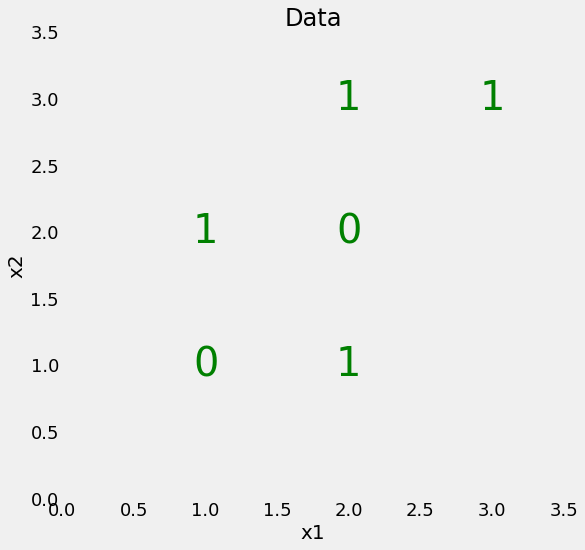
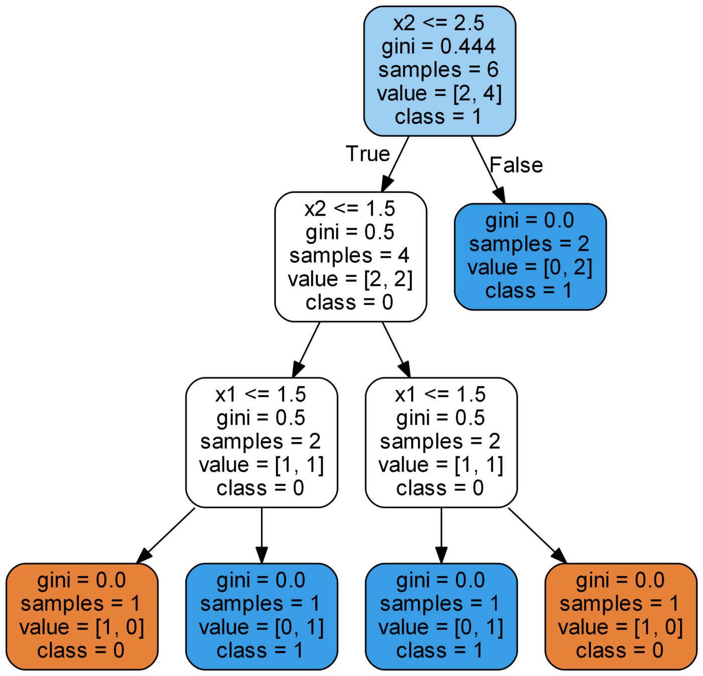
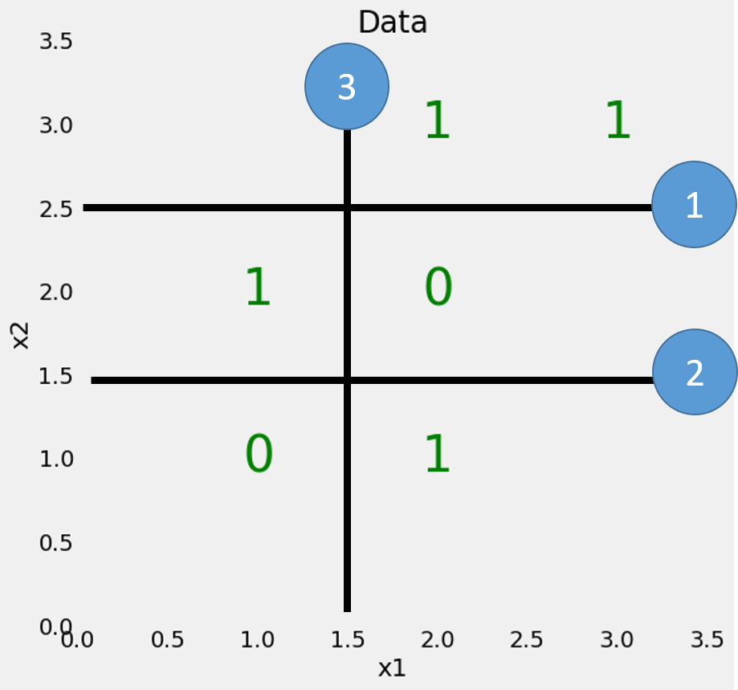
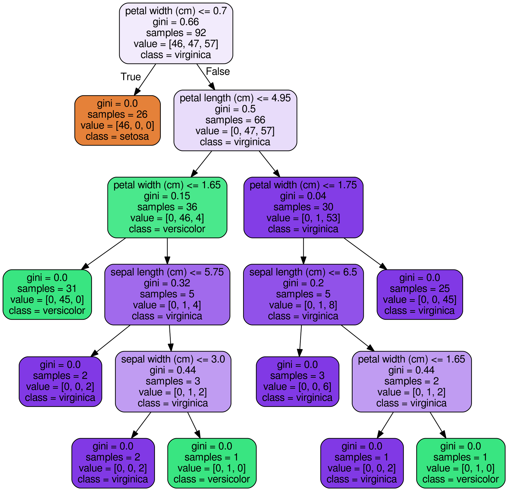

# Decision Tree

Also known as **CART: Classification And Regression Trees**.

**The representation for the CART model is a binary tree.**

Creating a CART model involves selecting input variables and split points on those variables until a suitable tree is constructed.

The selection of which input variable to use and the specific split or cut-point is chosen using a greedy algorithm to minimize a cost function. Tree construction ends using a predefined stopping criterion, such as a minimum number of training instances assigned to each leaf node of the tree.

## Greedy Splitting

This is a numerical procedure where all the values are lined up and different split points are tried and tested using a cost function. The split with the best cost (lowest cost because we minimize cost) is selected.

### Regression

For **regression** predictive modeling problems the cost function that is minimized to choose split points is the sum squared error across all training samples that fall within the rectangle:

$ \begin{align} \tag{1}costfn = \sum_{i=1}^n(y – prediction)^2  \end{align}$

Where `y` is the ouput of the training example and `prediction` is the predicted output.

We can also choose Variance of the node as the cost function, i.e. low variance is a better split. 

$\begin{align} \tag{2} variance = \frac{\sum(X  - \overline{X})^2}{n} \end{align}$

### Classification

For **classification** the Gini index function is used which provides an indication of how “pure” the leaf nodes are (how mixed the training data assigned to each node is).

$\begin{align} \tag{3} I_G(n) = 1 - \sum_{i=1}^{J}(p_i^2) \end{align}$

Where $$I_G(n)$$ is the **Gini index** or the **Gini Impurity** for node `n` over all classes `J `, $$p_i$$ is the fraction of examples in class  `i`.  

A node that has all classes of the same type (perfect class purity) will have G=0, where as a G that has a 50-50 split of classes for a binary classification problem (worst purity) will have a G=0.5.

The Gini index calculation for each node is weighted by the total number of instances in the parent node.

**Note: Gini Impurity gives a sense of Homogeneity, i.e. Lesser the `IG` More the Homogeneous the collection**

We can also use the entropy for calcuating the node’s entropy where entropy -> 1 mean impure node and entropy -> 0 means pure node.

$\begin{align} \tag{4} cross-entropy = - \sum_{i=1}^k p_ilog(p_i)\end{align}$


## Stopping Criterion

The most common stopping procedure is to use a minimum count on the number of training instances assigned to each leaf node. If the count is less than some minimum then the split is not accepted and the node is taken as a final leaf node.


## Pruning the Tree

We can use pruning after learning a tree to further lift performance. The fastest and simplest pruning method is to work through each leaf node in the tree and evaluate the effect of removing it using a hold-out test set or a validation set. Leaf nodes are removed only if it results in a drop in the overall cost function on the entire test set. You stop removing nodes when no further improvements can be made.

More sophisticated pruning methods can be used such as cost complexity pruning (also called weakest link pruning) where a learning parameter (alpha) is used to weigh whether nodes can be removed based on the size of the sub-tree.


## Constraints

We need to provide some constraints when creating a decision tree to stop the tree from overfitting the train-set. This way we can get a less biased Decision Tree which will perform better on test data.

- **Minimum samples for a node split**
  - Used to control over-fitting. Higher values prevent a model from learning relations which might be highly specific to the particular sample selected for a tree.
- **Minimum samples for termina node**
  - Generally lower values should be chosen for imbalanced class problems, i.e. when we dont have equal data for all the classes, because the regions in which the minority class will be in majority will be very small.
- **Maximum depth of tree**
  - Used to control over-fitting as higher depth will allow model to learn relations very specific to a particular sample.
- **Maximum number of terminal nodes**
  - Can be defined in place of max_depth. Since binary trees are created, a depth of ‘n’ would produce a maximum of 2^n leaves.
- **Maximum features to consider for split**
  - As a thumb-rule, square root of the total number of features works great but we should check upto 30-40% of the total number of features.
  - Higher values can lead to over-fitting but depends on case to case.


# Working Example

## Simple Binary Classification



Here we have 2 features -> x1 and x2. We only have 6 data points but they are not linearly seperable. We can however draw a series of straight lines that divide the data points into boxes, which we’ll call nodes.

```python
from sklearn.tree import DecisionTreeClassifier

tree = DecisionTreeClassifier(random_state = 1)
tree.fir(X, y)

print(tree.score(X, y))
```

### Tree model



The average weighted Gini Impurity decreases as we move down the tree. 

- `sample` is the no of observations in the node.
-  `value` is the no of samples in each class.
-  `class` is the majority classification for the points in the node, in the case of leaf node, it is the prediction for all the samples in the node.

The rectangle drawn by the binary tree is as follows:




$$I_{root} = 1 - ((\frac26)^2 + (\frac46)^2) = 0.444$$

$$I_{second layer} = \frac {n_{left}} {n_{parent}} * I_{left node} + \frac {n_{right}} {n_{parent}} *I_{right node} = \frac46*0.5 + \frac 26*0.00 = 0.333$$


## Iris Dataset

 



```python
from sklear.datasets import load_iris
from sklear.tree import DecisionTreeClassifier

iris = load_iris()
model = DecisionTreeClassifier()
model.fit(iris.data, iris..target)
print(model.score(iris.data, iris.target))
```


## Visualizing the tree in PNG format

```python
# assuming model is the tree classifier which has already been trained
from sklearn.tree import export_graphviz
export_graphviz(model, out_file='model.dot'
               features_names = columns,
               class_names = target_columns
               rounded = True, Proportion = True, precision = 2, filled = True)

from subprocess import call
call(['dot', '-Tpng', 'model.dot', '-o', 'model.png', '-Gdpi=600'])

from Ipython.display import Image
Image(filename = 'model.png')
```


------


# Miscellaneous Topics

## Choosing Split points

The set of split points considered for any variable depends upon whether the variable is numeric or categorical. When a predictor is numeric, if all values are unique, there are n – 1 split points for n data points.When a predictor is categorical we can decide to split it to create either one child node per class (*multiway* splits) or only two child nodes (*binary* split). 

In categorical feature, if k is the no of classes supported by that feature then if k is large, there are more splits to consider. As a result, there is a greater chance that a certain split will create a significant improvement, and is therefore best. This causes trees to be *biased* towards splitting variables with many classes over those with fewer classes.

So now we consider every possible split points for every feature taken one at a time and try to find the cost-of-split from the following formula

$\begin{align} \tag{5} Cost\space of\space split = \frac{N_{samples-left}}{N_{samples-parent}}*Cost-fn_{left} + \frac{N_{samples-right}}{N_{samples-parent}}*Cost-fn_{right} \end{align}$

If we find the Cost-of-split for a split point to be the least among all, then we split using that split point. But if for all split points for all features, the cost-of-split is not less than the cost-fn value of current node then we dont split it further. This informs us that the node cant be split into further nodes which yeild more meaning than the current node. 

Another way is to set a thershold $\delta$ where if the `cost of split`  is greater than then $\delta$ then we dont split that node further.

**Note**: Cost-fn here can be any of the 4 cost functions described above.

**Note**: Which feature is selected in which node is just a matter of chance, only the feature whose one of the split points gives the best `cost-of-split` is chosen.