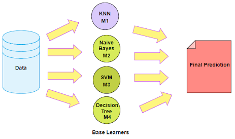

# Ensembling

An Ensemble method is a technique that **combines the predictions from multiple machine learning algorithms** together to make more accurate predictions than any individual model. A model comprised of many models is called an **Ensemble model**.

# Types of Ensembling Learning

## Boosting

Boosting refers to a group of algorithms that utilize weighted averages to make weak learners into stronger learners. Boosting is all about “teamwork”. Each model that runs, dictates what features the next model will focus on.

In **boosting** as the name suggests, one is learning from other which in turn **boosts** the learning.

## Bootstrap Aggegation (Bagging)

Bootstrap refers to **random sampling with replacement**. Bootstrap allows us to better **understand the bias and the variance** with the dataset. Bootstrap involves random sampling of small subset of data from the dataset.

It is a general procedure that can be used to **reduce the variance** for those **algorithm that have high variance, typically decision trees**. Bagging makes each model run independently and then **aggregates the outputs at the end without preference to any model**.

# Models Using Ensembling

- Random Forest
- XGBoost

