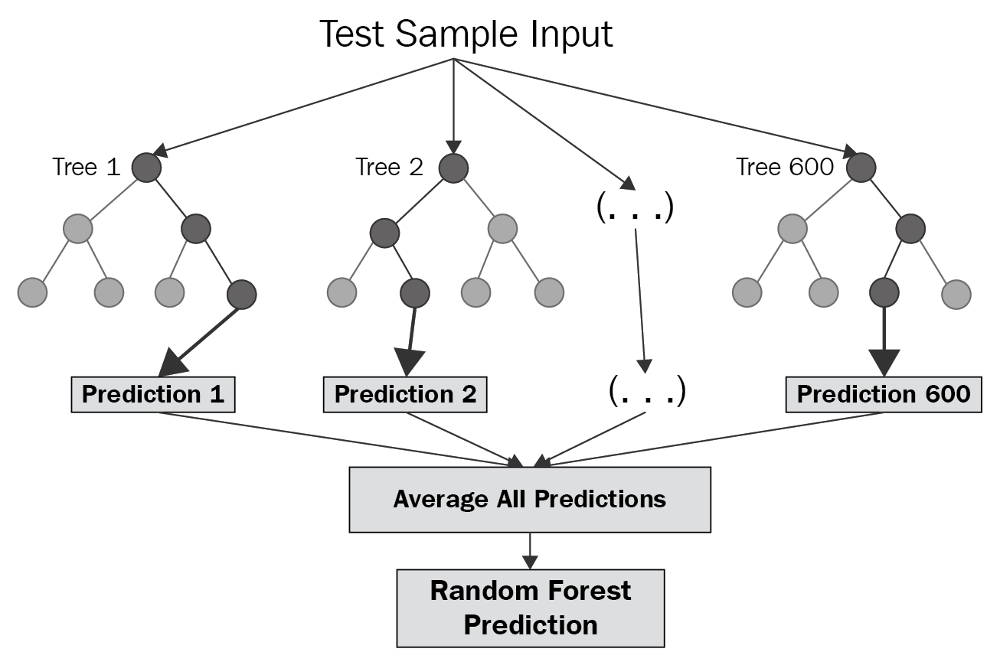

# Random Forest



**Random forest** is a **bagging** technique and **not a boosting** technique. The trees in **random forests** are run in parallel. There is no interaction between these trees while building the trees. It operates by constructing a multitude of decision trees at training time and outputting the class that is the **mode** of the **classes (classification)** or **mean prediction (regression)** of the individual trees.

A random forest is a meta-estimator (i.e. it combines the result of multiple predictions) which **aggregates many decision trees**, with some helpful modifications:

1. The number of features that can be split on at each node is limited to some percentage of the total (which is controlled using a **hyperparameter**). This ensures that the ensemble model **does not rely too heavily on any individual feature**, and makes **fair use of all potentially predictive features**.
2. Each tree draws a random sample from the original data set when generating its splits, adding a further element of randomness that prevents **overfitting**.


> Each decision tree in the forest considers a random subset of features when forming questions and only has access to a random set of the training data points. 


## Random Sampling of training data

When training, each tree in a random forest learns from a **random** sample of the data points. The samples are [drawn with replacement](https://en.wikipedia.org/wiki/Bootstrapping_(statistics)), known as *bootstrapping,* which means that some samples will be used multiple times in a single tree. 

At test time, predictions are made by averaging the predictions of each decision tree. This procedure of training each individual learner on different bootstrapped subsets of the data and then averaging the predictions is known as *bagging*, short for [*bootstrap aggregating*](https://machinelearningmastery.com/bagging-and-random-forest-ensemble-algorithms-for-machine-learning/)


## Random subsets of feature

The other main concept in the random forest is that only a [subset of all the features are considered for splitting each node](https://sebastianraschka.com/faq/docs/random-forest-feature-subsets.html) in each decision tree. Generally this is set to `sqrt(n_features)`.


## Feature and Advantages of Random Forest

1. It is one of the most accurate learning algorithms available. For many data sets, it produces a **highly accurate classifier**.
2. It runs efficiently on large databases.
3. It can **handle thousands of input variables** without variable deletion.
4. It gives estimates of what variables that are important in the classification.
5. It generates an internal **unbiased estimate of the generalization error** as the forest building progresses.
6. It has an **effective method for estimating missing data** and maintains accuracy when a large proportion of the data are missing.
7.  The random forest has **lower variance** (good) while maintaining the same **low bias** (also good) of a decision tree.


## Disadvantages of Random Forest

1. Random forests have been observed to **overfit for some datasets** with noisy classification/regression tasks.
2. For data including categorical variables with different number of levels, **random forests are biased in favor of those attributes with more levels**. Therefore, the variable importance scores from random forest are not reliable for this type of data.


# Scikit learn Implementation

```python
from sklearn.ensemble import RandomForestRegressor
regressor = RandomForestRegressor(n_estimators = n,
                                  random_state = 0,
                                  bootstrap=True,
                                  max_features = 'sqrt')
regress.fit(X, y)
predictions = regressor.predict(X_test)
```


------


# Feature Importance

The feature importances in a random forest indicate the sum of the reduction in Gini Impurity over all the nodes that are split on that feature. We can use these to try and figure out what predictor variables the random forest considers most important. 