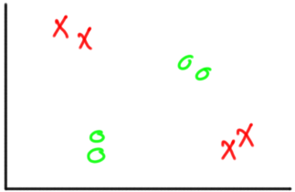
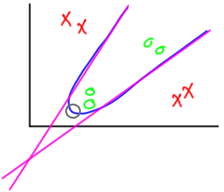
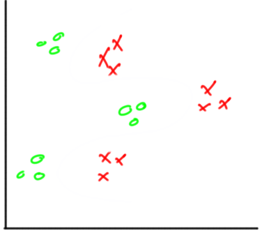
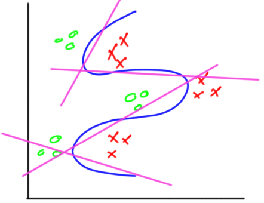
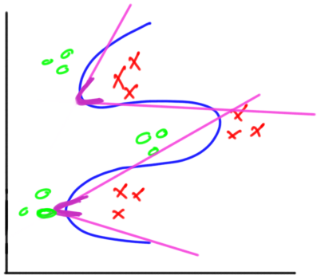

# Decising Hidden Layers

> **In artificial neural networks, hidden layers are required if and only if the data must be separated non-linearly.**

The biggest 2 question we try to find answers to when using a neural network are:

1. Number of Hidden Layers
2. Number of neurons in each hidden layer

Each neuron has a linear classifier which is governed by the equation:

$$\begin{align} \tag{1} \large y = w_1 + w_2*x_2 + ... +w_i*x_i + b\end{align}$$

Because each hidden neuron added will increase the number of weights, thus it is recommended to use the least number of hidden neurons that accomplish the task. Using more hidden neurons than required will add more complexity.

## 1 hidden Layer

So for eg:

For this example, we can create 2 linear lines to classify the examples:

And each line can be represented by 1 neuron as they are linear separators.

So only 1 hidden layer with 2 neurons is enough to classify this example. But we need another node to connect these 2 lines to create the blue-line kind of division. For that we need another level of complexity i.e. somehow to make these linear function a quadratic function, so we add another layer. 

But as there is only 1 point of connection we can just add another layer with 1 node. And this node can then act as our output.

So in this classifier we have

- input layer : 2 nodes defining x1 and x2
- 1st hidden layer: 2 nodes defining the pink lines
- output layer: joining the pink lines to create the blue-line kind structure

## 2 hidden layers

for eg:

Here we will need 4 lines to classify these areas. So 4 neurons in the 1st hidden layer.

Now for the rest of the architecture it depends on the model designer to choose the no. of hidden layers and nodes.

One way is to create a 2nd hidden layer where it will have 2 neuron, the 1st neuron acting as the connection of the 1st and 2nd pink line and the 2nd node acting as the connection between the 3rd and 4th pink line.

It will create a structure like this:-

And then create a 3rd hidden layer connecting the output of these 2 neurons of the 2nd hidden layer. This layer can also act as out output layer.