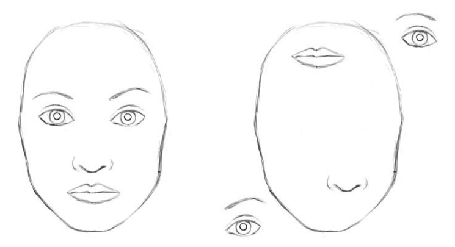
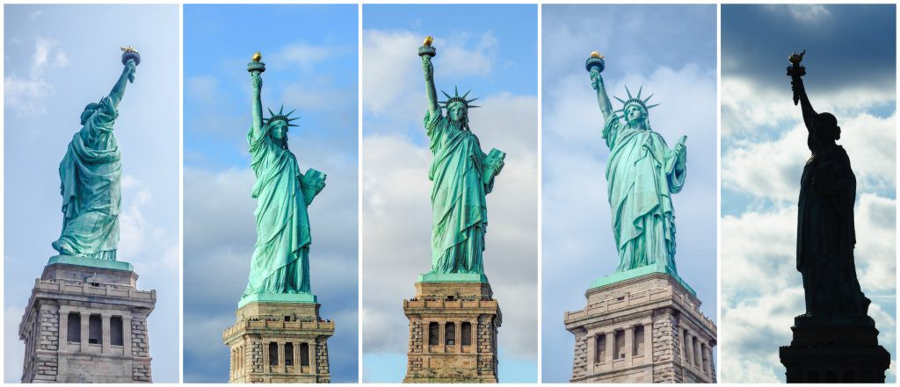

# Whats wrong with CNN?

How do CNNs work? The main component of a CNN is a convolutional layer. Its job is to detect important features in the image pixels. Layers that are deeper (closer to the input) will learn to detect simple features such as edges and color gradients, whereas higher layers will combine simple features into more complex features. Finally, dense layers at the top of the network will combine very high level features and produce classification predictions.

Nowhere in this setup there is **pose** (translational and rotational) relationship between simpler features that make up a higher level feature.

> Internal data representation of a convolutional neural network does not take into account important spatial hierarchies between simple and complex objects.

And as we apply pooling, we loose this spatial heirarchical features and so down the line, CNN is further not able to learn these features.

For eg: Below are 2 images, left is of a face and the right is of a pic with all the charachteristics of a face but still we can distinguish that it is not a face.

But to a CNN, as all the features(2 eyes, 1 nose, oval shape face outline, lips) are present, it will categorise this as a face.

Another eg: 

Here are pictures of the “Statue of Liberty” from different angles. We can recognize each as the statue of liberty but for a CNN, it wont be able to recognize it from all the angles, as it lack the information about the **“pose”**.

# Working of CapsNet

The crux of Capsule network and the **capsule theory ** lies in the understanding of comuter graphics. In computer graphics we define various features of an object to render it appropriately. Once these features has be defined, we can render the model with any given lighting and angle. 

Our brain does the same thing but in reverse direction. It on seeing an object tries to learn the features and spatial realtionships between them to learn about the object and then categorises it. So the next time when our brain looks at the same object but from a different **pose** it understands it and categorizes it correctly.

This process is termed as **“inverse graphics”** by the inventor **Geoffrey Hinton** of CapsNet.

He with his team introduced 2 papers regarding the caps-net.

1. Introduces the idea of CapsNet
2. Introduces *dynamic routing between capsules*, the algorithm to achieve a CapsNet.

We can understand it by an anology:- 

- *CapsNet* can be reffered to as a new architecture like *Neural Network* itself, which was in theory since the late 1940s but never implemented.
- *Dynamic Routing between Capsules* can be reffered to as an algorithm similar to *back-propagation*, introduction of which in the late 1980s made the implementation of Neural Network possible.

# Main Advantages of CapsNet

- It can learn the heirarchical relationships between features.
- It can learn the concept of pose of an image
- It can recognize images from a different angle without ever being trained with that angle
- It requires less data to train
- It gives an approx 45% reduced error compared to CNNs.