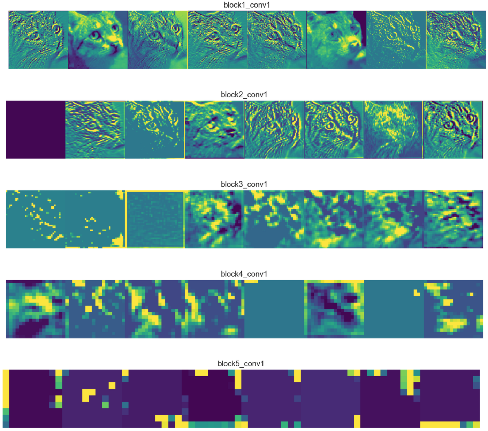
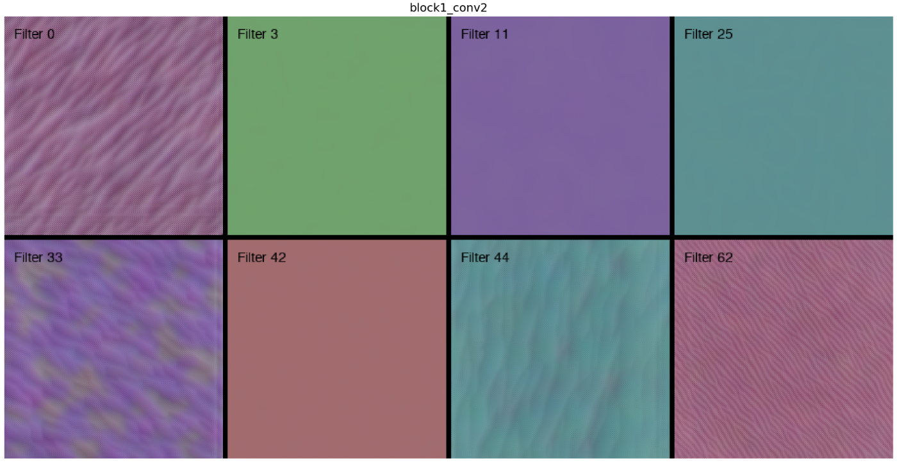
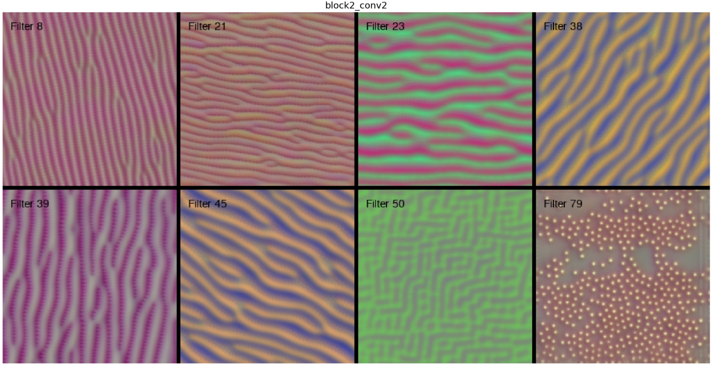
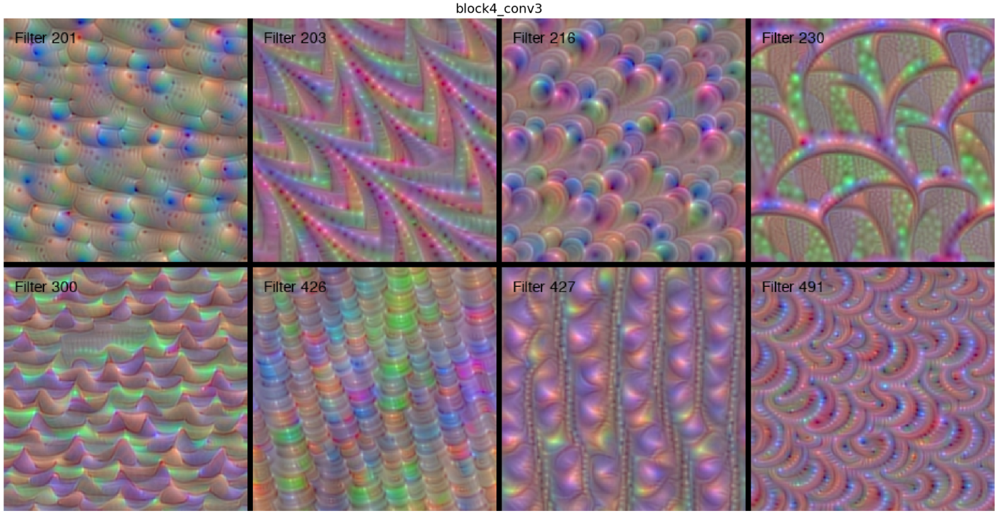
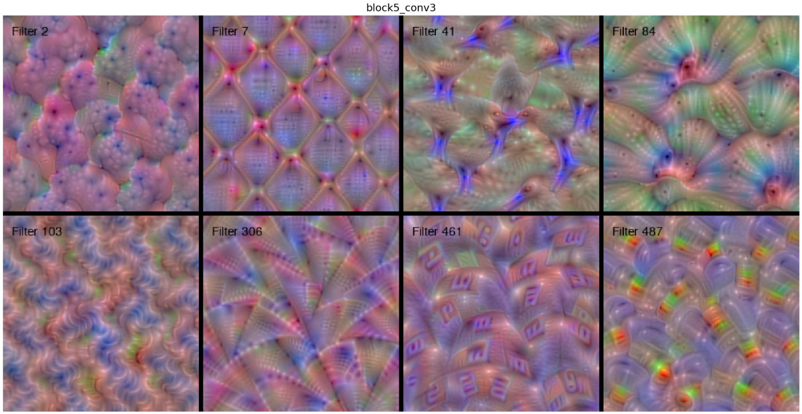

# Working of a CNN

Best way to understand the working of CNN is to visualize each component of a CNN.

Let say we have a CNN that can classify dogs an cats.

## Feature Map

As you can see that the initial layers of the CNN, works mostly as an edge detector, thus the output feature is more prominent to us.

As we go deeper into the CNN, the feature becomes more vague and we are not able to understand the feature it is extracting. This is because as we go deeper, the feature extracted are more specific, for eg: nose, tail, ears etc of cats and dogs.

So when we give a pic as input the layers will first try to identify the edges as shown in the initial layers. And as we go deeper only those nodes in each layer will get activated which represent specific features.

For eg, if we give a cat’s pic as input, as we go deeper only specific nodes representing the cat’s feature will get activated, and when this is given as input to the fully connected layer, it acts like a feature set for the fully connected layer. Now it’s only job left is to identify given these features whether it is a cat or a dog.

## Kernels or Filters

As we saw that the initial feature maps are more of edge detectors, and as we go deeper into the model, the feature maps are more of specific feature detector, so we can guess how our kernels will change as we go from the initial layer to the final convolution layers.

For detecting the edges, the initial kernels have to simple kernels.

As we can see here, the kernels are more of edge and color detectors.

For the 2nd layer:

These are still edge detectors, but a bit more advanced so as to detected complex edges.

Further down the line, kernels look like these:

And like these

We can see that the Filter41 tries to detect a bird’s face. The filter has bird’s face alligned in multiple angles so that if the input image has a bird in any angle this will be able to detect it.